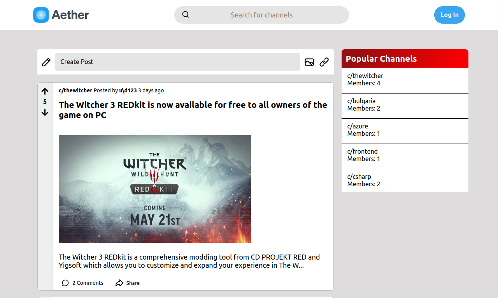
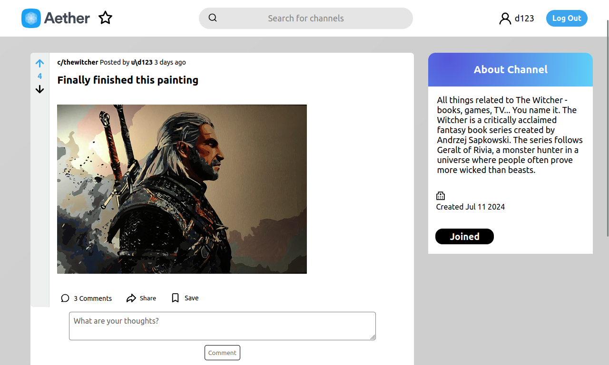

# [🌀 Aether](https://aether-zeta.vercel.app)
 ##### Aether is a fully-functioning website, deployed at [aether-zeta.vercel.app](aether-zeta.vercel.app).  
 ##### The project consists of 2 parts - [React Frontend](#frontend) and [.NET backend](#backend).  
 ##### Aether was originally built as a frontend-only project for SoftUni ReactJS October 2023 project defense,  using the SoftUni Practice Server.  
 ##### The Practice Server can still be found in the jsServer folder. 

----

## Table of Contents
### Frontend 
  1. [Flow](#flow) 🔄
  2. [File Structure](#file-structure) 📁
  3. [Routing](#routing) 🛣️
  4. [Error Handling](#error-handling) ⚠️ 
  5. [Custom Hooks](#custom-hooks) 🪝
  7. [Authentication](#authentication) 🔒
  8. [Context Handling with Context API](#context-handling) 🗂️
  9. [Styling](#styling) 🎨
  10. [Dependencies](#dependencies) 📦
  11. [Deployment](#deployment---frontend) 🚀

### Backend

1. [Introduction](#introduction) 🌟
2. [Project Structure](#project-structure) 📁
3. [Configuration](#configuration) ⚙️
4. [Services](#services) 🛠️
5. [Endpoints](#endpoints) 🔗
6. [Auth](#auth) 🔒
7. [Middleware](#middleware) 🌐
8. [Deployment](#deployment---backend) 🚀

-----

# Frontend ↓

## Flow  

<br>
<h3>The home page features a clean, welcoming design with a central navigation bar, popular posts and a search bar for easy access to content.</h3>

<br>

---

<br>
<h3>Any user interaction( joining a channel, liking / creating a post, leaving a comment ) is limited and the user is prompted to login or create an account</h3>

<br>

--- 

<br>
<h3>User input is properly validated </h3>

<br>

---

<br>
<h3>When the user logs in, they can see a personalized dashboard, or in the case of a new user - a welcoming screen</h3>

<br>

---

<br>
<h3>From there on, users can interact with posts: Rate, Share, Save</h3>

<br>

---

<br>
<h3>And they can also have discussions in the comment section  of a post</h3>

<br>

-----

### File Structure  
📁
- **components/**: Contains all the React components used in the application. Each component has its own directory for better modularization.
  - **Channel/**: Contains components related to the channel feature.
  - **Home/**: Components related to the home page.
  - ...

- **contexts/**: Contains context providers for managing global state using React's Context API.

- **hooks/**: Custom hooks for reusable logic across the application.

- **services/**: Contains service modules for handling API calls and business logic.

- **utils/**: Utility functions and helpers.
----

### Routing  
🛣️

  **Router** - Aether is using the default BrowserRouter, prodided by React-Router.  
  **Routes** - All routes are defined in the App.jsx component.  
  **Route Guards** : 
  - Non-existent routes :
    ```jsx
    <Route path='/*' element={<Page404 />} />
    ```
  - Unexpected errors :
    ```jsx
    <Route path="/error" element={<ErrorPage />}/>
    ```
-----

### Request Handling  
  **request.js**  
  An http request abstraction using the fetch api, that has the following structure:
  ```
    get(url, accessToken)
    post(url,accessToken,bodyData)
    put(url, accessToken, newData)
    Delete(url, accessToken, bodyData)
  ```
  Each of these methods returns the raw Response object. 
    
  ***record*Service.js**   
  - A collection of services for each of the database records 
  - Using the aforementioned *request.js* abstraction  
  - Main function is handling request routes and CRUD operations for the repspective record
  
-----

### Error Handling  
⚠️

  #### Local & Async    
  ```jsx
  const navigate = useNavigate();
  try{
    // ...do something, fetch, etc.
  }
  catch(e){
    navigate("/error");
  }
  ```
  #### Global
  
  ```jsx
    <GlobalErrorBoundary>
      // Routes, Components, etc
    </GlobalErrorBoundary>
    // wraps around components 
    // detects synchronious errors using the getDerivedStateFromError method on Component class
    // renders Error component
  ```
  
----
### Custom Hooks  
🪝

- #### useDebounce
    
    A utility used for rate-limiting (debouncing) a given function.
    
    ##### Parameters
    
    - `callback`: The callback function to be debounced.
    - `delay`: The debounce delay in milliseconds.
    - `dependency` (optional): Dependencies to watch for changes.
    
    ##### Returns
    
    - `debounceCallback`: Debounced callback function.
    
    ##### Example Usage
    
    ```jsx
    
      const handleSearch = async (query) => {
        const result = await searchFor(query);
        // ...do something with result
      };
    
      // Debounce the search function with a delay of 500ms
      const debouncedSearch = useDebounce(handleSearch, 500);
    
      useEffect(() => {
        const userInput = "Example Input";
        // Example usage: HandleSearch is executed only after 500ms of user input
        debouncedSearch(userInput);
      }, [debouncedSearch]);
    ```
    ***
- #### useDisabled
  The `useDisabled` hook is designed for managing the state of disabled operations in React components  
  Particularly useful for async operations like fetching data or submitting forms.
    ##### Parameters
    
    - `callback`: The asynchronous callback function to be executed.
    
    ##### Returns
    
    An array with the following elements:
    - `disabled`: A boolean state indicating whether the callback is currently disabled.
    - `callbackWithDisable`: A function that wraps the provided callback and manages the disabled state.
    - `setDisabled`: A function to manually set the disabled state.

    ##### Example Usage

    ```jsx
    import { useState } from 'react';
    import useDisabled from './useDisabled';
    
    const ExampleComponent = () => {
      const fetchData = async () => {
        // Simulate fetching data
        console.log('Fetching data...');
        await new Promise(resolve => setTimeout(resolve, 2000)); // Simulated delay
        console.log('Data fetched!');
      };
    
      const [disabled, callbackWithDisable, setDisabled] = useDisabled(fetchData);
    
      return (
        <div>
          <button onClick={() => callbackWithDisable()}>Fetch Data</button>
          <p>Button is {disabled ? 'disabled' : 'enabled'}</p>
          <button onClick={() => setDisabled(true)}>Disable</button>
          <button onClick={() => setDisabled(false)}>Enable</button>
        </div>
      );
    };
    ```
    ***
- #### useLoading
  This hook simplifies managing loading states and error handling for async operations in React components
  ##### Parameters
    - `callback`: The asynchronous callback function to be executed.
    - `errorCallback` (optional): A function to handle errors that occur during the callback execution.

  #### Returns

    An array containing:
      - `loadingSpinner`: A component function that displays a loading spinner based on the `isLoading` state.
      - `callbackWithLoading`: A function that wraps the provided callback, setting `isLoading` to `true` before execution and `false` afterwards.
      - `isLoading`: A boolean state indicating if an operation is currently loading.

  ##### Example Usage
  
  ```jsx
  import { useState } from 'react';
  import useLoading from './useLoading';
  
  const ExampleComponent = () => {
    const fetchData = async () => {
      // Simulate fetching data
      console.log('Fetching data...');
      await new Promise(resolve => setTimeout(resolve, 2000)); // Simulated delay
      console.log('Data fetched!');
    };
  
    const handleFetch = async () => {
      try {
        await callbackWithLoading(fetchData);
      } catch (error) {
        console.error('Error fetching data:', error);
      }
    };
  
    const [loadingSpinner, callbackWithLoading, isLoading] = useLoading(handleFetch);
  
    return (
      <div>
        {loadingSpinner({ size: 50 })}
        <button onClick={handleFetch} disabled={isLoading}>
          {isLoading ? 'Fetching...' : 'Fetch Data'}
        </button>
      </div>
    );
  };
  ```
-----

### Authentication  
🔒
  - #### authService.js
    Responsible for API requests to the backend, expects an accessToken in return
  - #### LogIn.jsx & SignUp.jsx
    Responsible for taking in user input and executing a request through authService  
    Validation is internal
  
  - After successful authentication response from the server,  the userData, along with the accessToken (JWT) are stored inside a [Context](#context-handling)  
  - After a failed authentication there's instant feedback and limiting of sending wrong auth data requests
-----
### Context Handling  
🗂️

  - ####  UserData Context
    ##### Returns `[userData, setUserData]`
    ##### Authentication Management
      Stores and serves the accessToken needed for authenticated actions  
    
    ##### User Data Passing
      Makes userData accessible to all components  

  - ####  UserModal Context
    
    ##### Modal State Control
      Tracks and serves whether the modal is open or closed, allowing components to respond accordingly.

-----

### Styling  
🎨

#### Global Styles

Global styles and variables, such as font sizes, weights, and colors, are defined in `index.css` using CSS custom properties.

#### Component Styles
CSS Modules (`Component.module.css`) are used for component-specific styles.  
In every Component folder, there's a styles folder, containing the respective CSS module for each component

-----

### Dependencies   
📦
```json
  "@iconscout/react-unicons-solid": "^1.0.2",  
  "react": "^18.2.0",  
  "react-dom": "^18.2.0",  
  "react-router-dom": "^6.18.0"
```
-----

### Deployment - Frontend
🚀

  Client-side code is deployed on Vercel, utilizing the `client-production` branch for production deployments.  
  A live version is available at [aether-zeta.vercel.app](https://aether-zeta.vercel.app)
  
------

# Frontend ↑
# Backend  ↓ 

-----

### Introduction
🌟
The backend of Aether is a REST API, built with the following technologies:
 - **.NET 8**
   - **Minimal API**
   - **ADO.NET**
 - **PostgreSQL**
 - 
-----

### Project Structure
📁
- **Api/**: Contains the main API logic and configurations.
  - **Endpoints/**: Directory for API endpoint definitions.
  - **Middleware/**: Custom middleware for error handling, authentication, etc.
  - **ServiceRegister.cs**: Registers services and dependencies for dependency injection.
  - **appsettings.json**: Configuration file for general application settings.

- **Models/**: Contains the data models and related classes.
  - **DbRecords/**: Classes representing database records.
  - **Helpers/**: Helper classes for models.

- **Services/**: Contains the business logic and service classes.
  - **Exceptions/**: Custom exceptions used across the services.
  - **Helpers/**: Helper classes for services.
  - **Services/**: Directory containing various service implementations.

-----

### Configuration
⚙️
 ##### Configuration Sources

   - Azure Environment Variables: Connection String, Token Signing Credentials.

   - appsettings.json: Default application settings.
 ##### Implementation
 ```csharp
 IConfiguration config =  new ConfigurationBuilder()
            .AddJsonFile("appsettings.json")
            .AddEnvironmentVariables()
            .Build();
 ```
-----

### Services
🛠️
 ###### DbService.cs
  Any connection to the database is handled through this abstract class. Derived services do not access the db connection.  
  
 - **Configuration Initialization**
   - Using Dependency Injection for the configuration itself
   - Retrieves the connection string from the configuration.
   - Handles potential configuration issues.
 
 - **Methods**
   - **`RecordExistsAsync<T>`**: Checks if a record exists asynchronously with various overloads to support different parameter types.
   - **`RecordExistsUnionAsync<T,F>`**: Checks if a record exists based on two columns and their values asynchronously.
   - **`ExecuteQueryCommandAsync<T>`**: Executes a query and retrieves a single record asynchronously.
   - **`ExecuteQueryListCommandAsync<T>`**: Executes a query and retrieves a list of records asynchronously.
   - **`ExecuteNonQueryCommandAsync`**: Executes commands asynchronously.
   - **`ExecuteScalarAsync`**: Executes a scalar command and retrieves a single value.
  
  ##### DbService Derivatives
   Any service derived from the DbService class can use all the listed methods  
   Handles CRUD operations and any other SQL query , as well as data collision  
   Default data for Db Records is handled by the service, but if not, the database is configured to handle it  
   Error handling is done by thrown exceptions
   

-----

### Endpoints
More information about the API's endpoints can be found in
<a href="./readme_assets/Endpoints.md">Endpoints.md</a>

-----

### Auth
🔒
 Aether user JWT for it's authentication. JWT signing credentials are passed down from azure environment variables.
 Endpoints are authenticated by default, and those which aren't use `.AllowAnonymous()` method at the end of declaration.
 
 Authentication is handled with the help of the following classes:
   ##### AuthenticationResult
   
```csharp
class AuthenticationResult
{
  bool IsSuccessful;
   User UserData;
}
```

   ##### AuthService.cs
   
```csharp
class AuthService
{
   // Takes a newly generated user or a logged in user and returns the JWT used for authentication
   string GenerateToken(Guid id);

   // Veirifies hashed password and returns an AuthenticationResult that's handled in the endpoint method itself
   AuthenticationResult Authenticate(UserCredentials u);

   // Ensures user identity, hashes password and creates a db record of the user and his credentials
   User SignUp(SignUpData s); 
}
```
     
 More information about the Auth Middleware in the [Middleware Section.](#middleware)
 
-----

### Middleware
🌐

 **Auth Middleware**
  - GET Endpoints and "/auth" endpoints are not authenticated by the middleware
    (Some Authentication for GET endpoints is handled inside the endpoints themselves - comparing jwt signing key with data provided)
  - Returns 403 Forbidden If:
    - User Identity is not authenticated in the http context
    - userId JWT claim is null
    - userId JWT claim is not a valid Guid

      <br>
      
 **Exception Handler**  
 Basic exception handler for catching exceptions thrown by services or internal exceptions. Returns an http response with a messsage(if passed).

Catch clauses
 - BadHttpRequestException => 400
 - NotFoundException => 404
 - ConflictException => 409
 - InvalidConfigurationException => 500
 - NpgsqlException => 500 + details ( non-sensitive )
 - Exception => 500
   
-----

### Deployment - Backend
🚀

 Aether Web Api, as well as the PostgreSQL database for the project,  
 are deployed on Azure using the Free Tier for both App Services and Postgre Flexible Server.
 
-----
